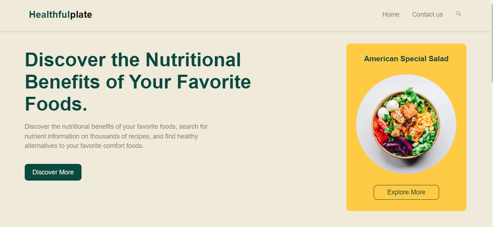
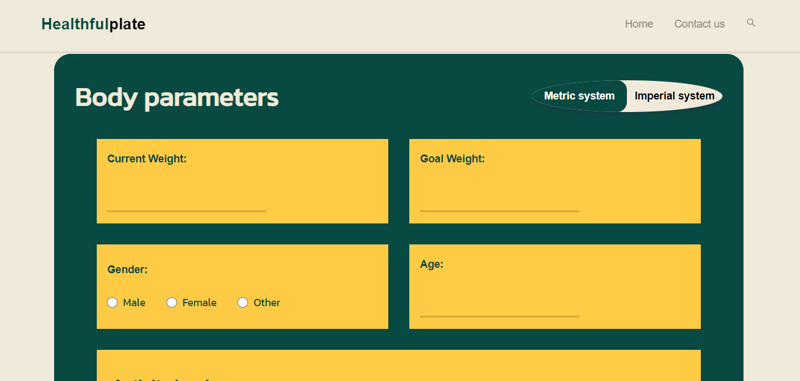
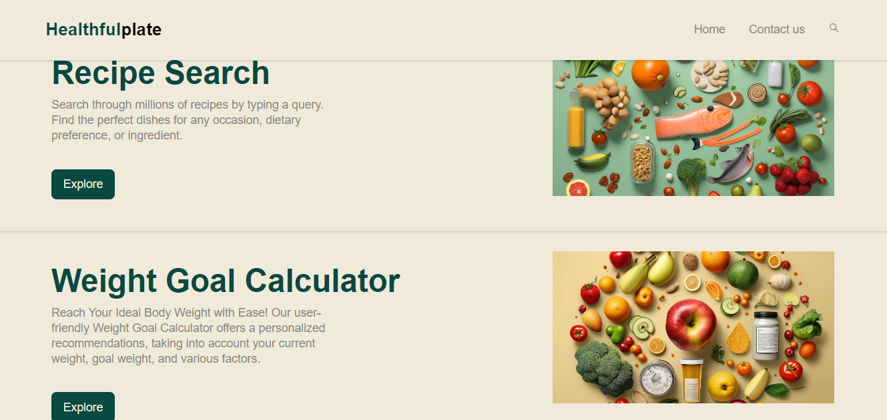
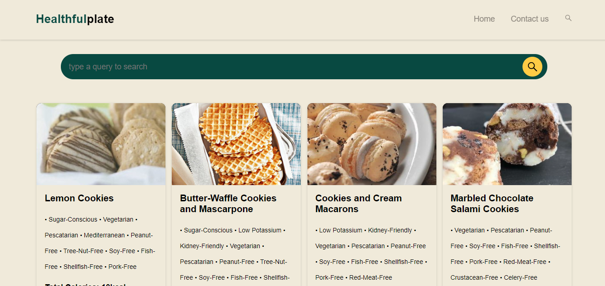

# HealthfulPlate - Where Wellness Meets the Plate


## Description :

"HealthfulPlate" is a vibrant and user-friendly React website that combines the best of nutrition and health. Featuring three distinct pages, the platform offers a diverse set of services. The home page provides an array of wellness resources and information. On the second page, users can easily search for recipes and get detailed nutritional facts for each recipe. However, the real gem of the website is its third page, a fairly comprehensive weight calculator (I worked very hard on this feature where I feel I can use such a word lol), designed to help users achieve their weight goals. This feature takes into account various input parameters such as current weight, goal weight, height, age, activity level, gender, and more, using formulas like the Harris-Benedict formula and TDEE, adjusted with the user's chosen timeframe. HealthfulPlate is designed with the intention of being a colorful and eye-pleasing platform. The codebase has reusable components, is readable and scalable, which makes it highly efficient for adjusting and scaling up the codebase.








## Technologies Used :

- React js
- Scss
- Context API
- Node js
- edamam API
- Axios
- And other libraries


## Installation :

1. Clone the repository to your local machine using the following command:

```
 git clone https://github.com/Yazid04/HealthfulPlate.git
```

2. Navigate to the repository's directory on your local machine:

```
 cd HealthfulPlate
```

3. Install the dependencies using npm or yarn:

```
 npm install
```

OR

```
 yarn install
```


## Configuration :

4. Create a .env file in the root directory with the following content:

```
  REACT_APP_EDAMAM_APIKEY=YOUR_API_KEY
```
```
 REACT_APP_EDAMAM_APPID=YOUR_APP_ID
```
Note: Replace YOUR_API_KEY with your actual API key,
and the same goes for (YOUR_APP_ID). Which you can get from the edamam api website https://www.edamam.com/


## Running the App

5. Start the React app locally:

```
 npm start
```

OR

```
 yarn start
```

6. Open your web browser and go to http://localhost:3000 to see the app running locally.

**_That's it! You have successfully installed and set up HealthfulPlate locally._**  
 **_Made with ❤ by [@Yazid04](https://github.com/Yazid04)_**